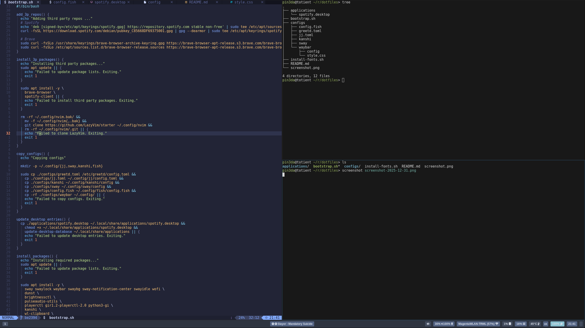
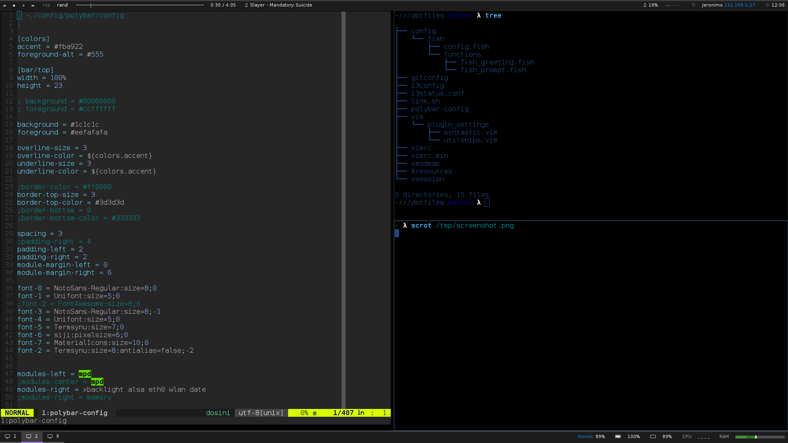

# dotfiles

Files and configurations for my computer:

## Bootstrap 

On a fresh Debian installation, the bootstrap script will install all the dependencies and copy the configuration files.

The script can be run with `--configs-only` to skip the packages installation.

## Notes

### Useful links

- https://arewewaylandyet.com/

### TODOs 

- [ ] Install rust with mise
  - [ ] Install jj, impala-nm

## Screenshots (past)

### 2025

- sway (on wayland)
- waybar
- fish shell
- greetd + tuigreet

### 2018

- i3wm
- polybar
- fish shell

--------------

Manuel Pineda
