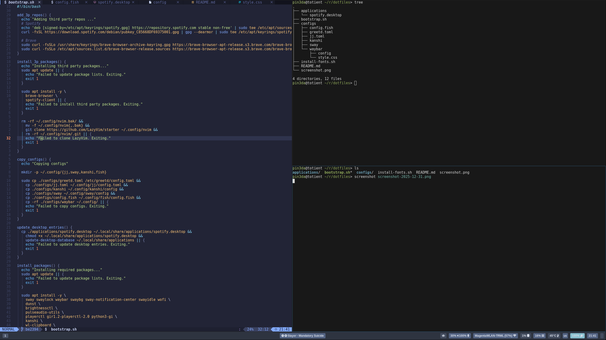
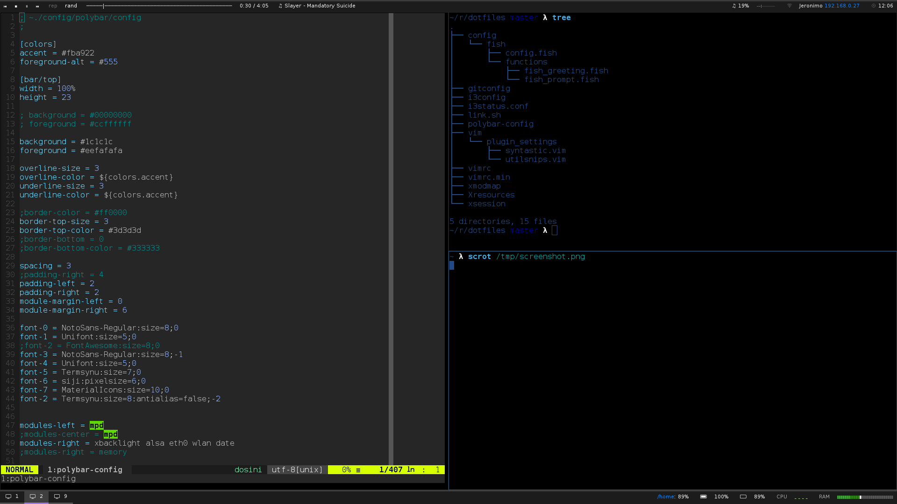

# dotfiles

Files and configurations for my computer:

## Bootstrap 

On a fresh Debian installation, the bootstrap script will install all the dependencies and copy the configuration files.

Each script called by `bootstap.sh` can also be called on its own.

## Notes

### Wayland screen sharing note

- On sway (`xdg-desktop-portal-wlr`), Chromium/Brave can share full screen, but single-window sharing may fail with `wlroots: No supported targets specified`.
- Current workaround: share full screen (or browser tab) until upstream Sway/portal support is fixed in distro packages.

### Useful links

- https://arewewaylandyet.com/

## Screenshots (past)

### 2025

- sway (on wayland)
- waybar
- fish shell
- greetd + tuigreet

### 2018

- i3wm
- polybar
- fish shell

--------------

Manuel Pineda
